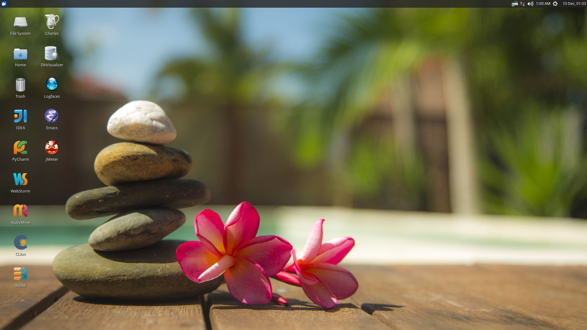

# Overview
This project is a Vagrant box that is provisioned for sofware development.  It is a Xubuntu-based system and 
has many of the tools needed by a developer already installed.  The provisioning mechanism is based on Ansible 
and allows for user-specific customizations to be applied.

# Prerequisites

* [Vagrant](https://www.vagrantup.com/) installed and working
* [VirtualBox](https://www.virtualbox.org/) installed and working
* [VirtualBox Extension Pack](https://www.virtualbox.org/wiki/Downloads) installed into VirtualBox 
* **[Virtualization support](https://en.wikipedia.org/wiki/X86_virtualization) enabled in your BIOS**
* a working internet connection
* Your corporate VPN running (if you want to apply some work-specific plays) 

# Building
All the components of the environment live in repositories on the internet so there is nothing to build.

# Installation
Use Git to clone this project, go into the project folder and type `vagrant up` and go get a cup of coffee.  The construction time of the box 
greatly depends on your internet speeds.

# Tips and Tricks

## RAM and CPU Settings
If you examine the `vagrantfile` file, you will see that the virtual machine is configured to use 6GB of RAM and
2 CPUs.  Feel free to change these values to match your computer's hardware.

## Low Disk Space
If an environment is used long enough, it is likely to run out of disk space.  The two main culprits are kernal updates 
filling up the `/boot` partition and Docker images filling up the `/opt/docker` partition.  You have at least 3 options:

* throw away the environment and start fresh
* clean up the old kernels via `sudo apt-get autoremove`
* clean up Docker containers via `docker rm --volumes --force $(docker ps --all --quiet)`
* clean up Docker images, after cleaning up the containers, via `docker rmi --force $(docker images --quiet)`
 
## Verifying The Setup
Log into the system with a username of `vagrant` and password of `vagrant`.

## Installed Infrastructure
Docker containers running common infrastructure are installed in `/home/vagrant/bin/servers`.  Look at the `docker-compose.yml` 
file to see what services are currently available to use.  Run the `start.sh` script to install and run the servers.  You can 
also start up a single server, eg `docker-compose up -d mongodb`.

## Docker-based IDEs
All of the IDEs are housed in Docker containers.  This allows for faster rebuilds of the environment and ensures that an
IDE's bits are not downloaded until needed.  The **initial launch of an IDE, however, can take several moments** as the Docker image is
downloaded from the repository.  You can pre-load the images by running `bin/prime-images.sh`, avoiding the delay.  Since this
grabs all images, it might make sense to examine the script and pull down only the images you are certain you will be using.

Some of the IDEs, when launched for the first time, will ask to create a convenience script or soft-link.  You should
**NOT** check that option because it is unnecessary in a container environment and requires `sudo` access, which the container
account does not have.

The containers are constantly being updated and improved.  If there is something missing or there is an issue with the container, 
please open a [ticket](https://github.com/kurron/jvm-development-environment/issues) or 
[pull-request](https://github.com/kurron/jvm-development-environment/pulls).

**UPDATE:** some memory issues have been ocurring so [IntelliJ IDEA](http://www.jetbrains.com/idea/), 
[PyCharm](http://www.jetbrains.com/pycharm/) and [WebStorm](http://www.jetbrains.com/webstorm/) have been reverted to 
non-Docker installations.

## Applying Your Work Specific Customizations
The system will look for an environment variable named `CORPORATE_PLAYS`.  If the shell running Vagrant specifies the variable 
such that it points to an Ansible project on GitHub, the plays will be run and the changes applied.  For example 
`export CORPORATE_PLAYS=kurron/ansible-pull-transparent.git` will result in 
[this playbook](https://github.com/kurron/ansible-pull-transparent.git) getting run.  If the environment variable does 
not exist, the custom provisioning step is not run.

## Applying Your Own Customizations
The system will look for an environment variable named `USER_PLAYS`.  If the shell running Vagrant specifies the variable 
such that it points to an Ansible project on GitHub, the plays will be run and the changes applied.  For example 
`export USER_PLAYS=kurron/ansible-pull-desktop-tweaks.git` will result in 
[this playbook](https://github.com/kurron/ansible-pull-desktop-tweaks) getting run.  If the environment variable does 
not exist, the custom provisioning step is not run. **Important: use a copy of the project if you decide to apply customizations.**  If you reference this project, you will get somebody else's customizations, including Git configuration, which most certainly do not want.

## Gather Docker Container Metrics
`sudo csysdig -pc` will fire up the sysdig tool.  Use `F2` to switch to the container view and see how each container is using
system resources.

## Docker-only Box
If you don't need a full desktop but just the Docker engine, try using [vagrant-docker-server](https://github.com/kurron/vagrant-docker-server)

## Sub-Projects
The provisioning of the environment is done by several smaller projects.  You might be interested in examining
exactly what they install and get a full inventory of the sofware and conveniences.

* [ansible-pull-development](https://github.com/kurron/ansible-pull-development)
* [ansible-pull-docker](https://github.com/kurron/ansible-pull-docker)
* [ansible-pull-operations](https://github.com/kurron/ansible-pull-operations)
* [ansible-pull-transparent](https://github.com/kurron/ansible-pull-transparent)

The README files also give insight into what they install and how to use them.

## Installed Software

* current [JDK](http://www.oracle.com/technetwork/java/index.html)
* [SDKMAN!](http://sdkman.io/) to manage various JVM tools, including Groovy, Grails, Gradle and Spring Boot
* Clojure's [leiningen](http://leiningen.org/) tool
* [NodeJS](https://nodejs.org/en/) and [npm](https://www.npmjs.com/)
* [Packer](https://packer.io/)
* [Terraform](https://terraform.io/)
* [AWS CLI](https://aws.amazon.com/cli/)
* [Ant](http://ant.apache.org/)
* [Maven](https://maven.apache.org/)
* [Docker](https://www.docker.com/)
* [Docker Compose](https://www.docker.com/products/docker-compose)
* [Docker Machine](https://www.docker.com/products/docker-machine)
* various [JetBrains IDEs](http://www.jetbrains.com/) running via Docker containers
* [httpie](https://github.com/jkbrzt/httpie) - a more friendly alternative to cURL and wget

# Troubleshooting

## Vagrant Box Does Not Come Up
If you find that when you are building a new box that it does not come up, try going into the `Settings->USB` section of your box in the VirtuabBox UI and disabling the USB controller. If you want USB support, make sure you have installed 
[VM VirtualBox Extension Pack](https://www.virtualbox.org/wiki/Downloads).

You should also double check that you have **enabled virtualization support** in your BIOS.

## Partial Failure
Sometimes networks fail or mirror sites go down. If you experience a failure, you can attempt to resume the construction 
by issuing `vagrant provision` at the command line.  Vagrant will attempt to start over, but will skip any provisions that
have already taken place. 

# License and Credits
This project is licensed under the [Apache License Version 2.0, January 2004](http://www.apache.org/licenses/).

